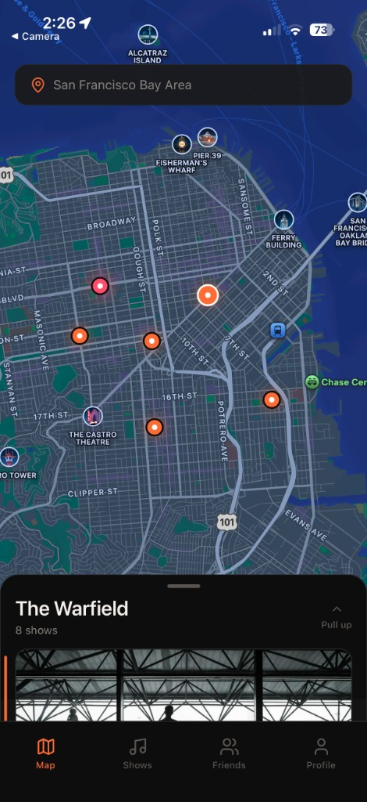
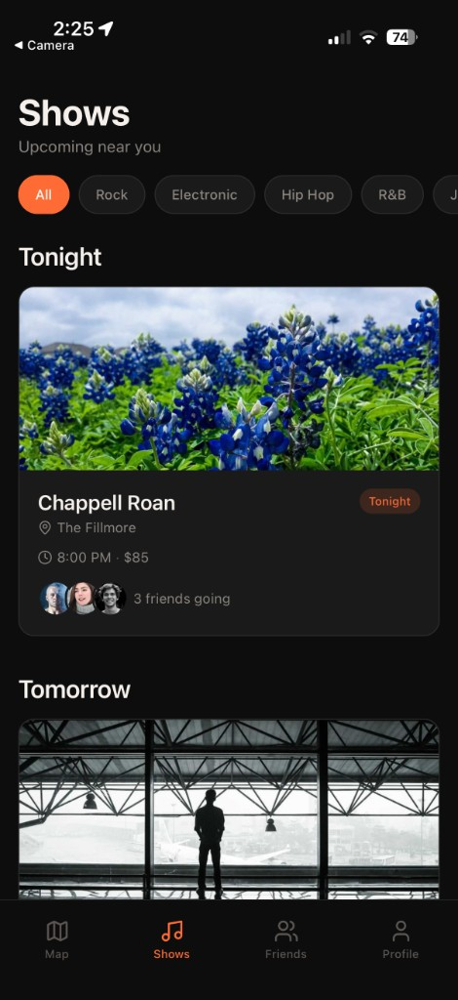
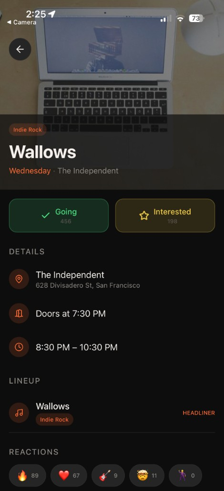
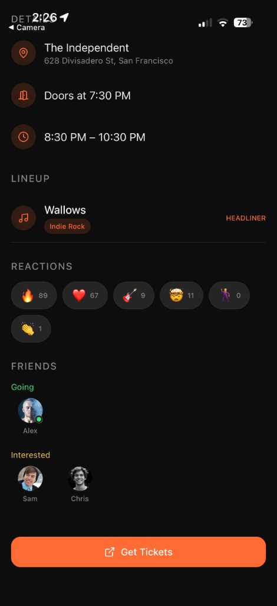
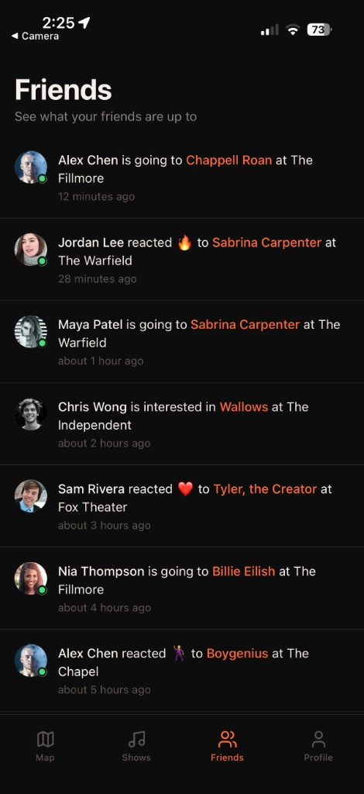
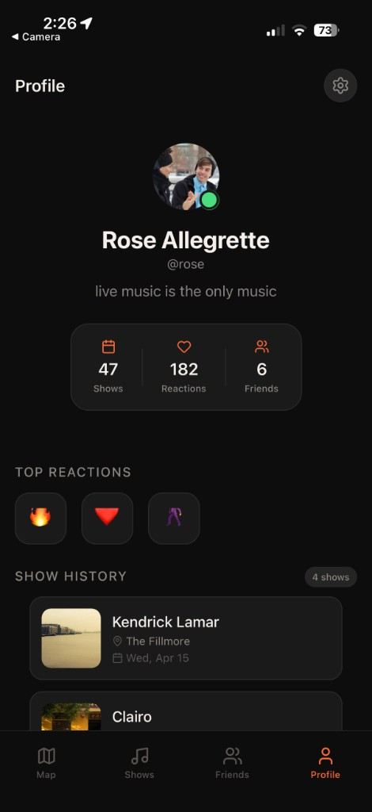
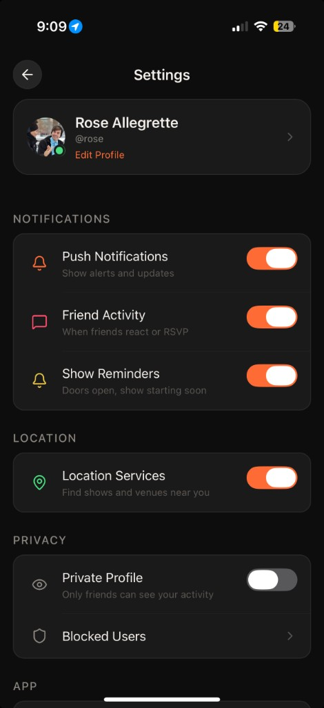
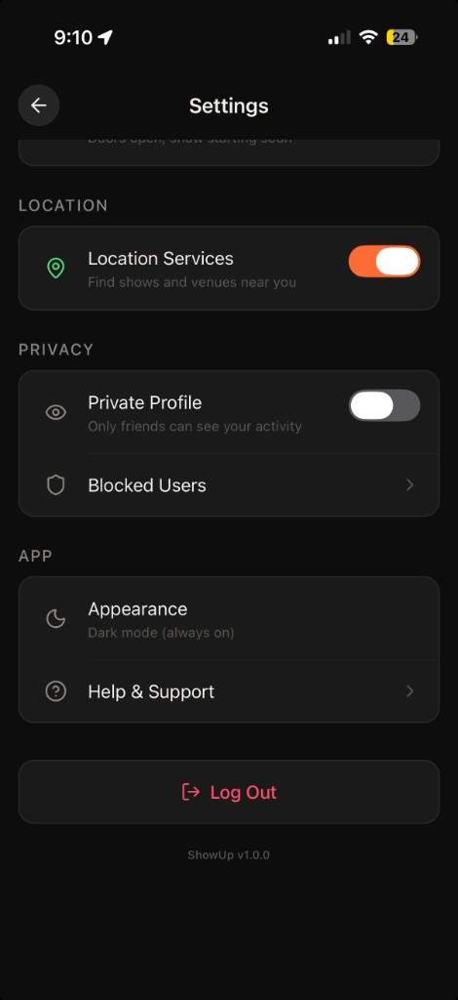

# ShowUp

**Find shows. React to them. See who's going.**

ShowUp is a map-first live music tracker built around how people actually decide to go out. You open the app, see what's happening near you tonight, check if anyone you know is going, and drop a reaction. No ticket queues, no Yelp-style reviews, no algorithmic feeds. Just shows, friends, and a map.

---

## The Problem

Every app that tracks live music is either a ticketing platform pretending to be social, or a social app that bolted on events as an afterthought. The experience of deciding to go to a show is fundamentally spatial and social -- *what's near me, what's tonight, and is anyone I know going?* -- but nothing is built around that.

ShowUp starts from that experience. The default screen is a map. Venues pulse when they have a show tonight. You tap one and see who's playing. Your friends' activity is a feed, not a search result. And instead of writing a review nobody reads, you tap a reaction emoji that bounces and buzzes in your hand.

---

## Screenshots

<p align="center">
  
  
  
</p>
<p align="center">
  
  
  
</p>
<p align="center">
  
  
</p>

---

## Screens

### Map View
Full-screen map with a dark custom style. Venue pins glow orange; tonight's shows pulse with a looping animation. Tap a pin and a draggable bottom sheet snaps open to that venue's shows, scrolled right to the top. Drag the sheet higher to browse everything nearby. The header updates to show the selected venue name and show count.

### Show Feed
Upcoming shows grouped by date -- Tonight, Tomorrow, This Week, Later. Horizontal genre filter chips (All, Rock, Electronic, Indie, Hip Hop, R&B, Pop) let you narrow down. Each card shows the artist image, venue, time, price, and stacked friend avatars with a count.

### Show Detail
Hero image with a gradient overlay, full artist lineup with genre badges, door and start times, and a six-emoji reaction bar. Each reaction (fire, heart, guitar, mind-blown, dancing, clap) bounces with spring physics and triggers a haptic tap. Toggle Going or Interested and watch counts update live. A friends section shows who else is going.

### Friends Activity
Reverse-chronological feed of what your friends are doing. "Maya is going to Billie Eilish at The Fillmore." "Jordan reacted with fire to Tyler, the Creator." Tap any item to jump straight to that show's detail screen.

### Profile
Your avatar, bio, and three stats -- shows attended, reactions given, friends. Below that, a scrollable history of past shows with the reactions you left on each.

---

## Tech Stack

| Layer | Choice | Reasoning |
|---|---|---|
| **Framework** | React Native (Expo SDK 54) | Mobile-first with fast iteration via Expo Go. No native build step for development. |
| **Language** | TypeScript (strict) | Fully typed API layer, discriminated unions for activity types, zero `any`. |
| **Navigation** | Expo Router | File-based routing with the same mental model as Next.js. Deep links for free. |
| **State** | Zustand | Three small stores with focused interfaces. No Redux boilerplate, no context nesting. |
| **Maps** | react-native-maps | Custom dark map styling, animated markers with pulse effects, location tracking. |
| **Animations** | React Native Animated API | Spring physics for reaction bounces, card presses, marker pulses, sheet gestures. |
| **Gestures** | PanResponder | Custom draggable bottom sheet with three snap points and velocity-based snapping. |
| **Images** | expo-image | Fast loading with crossfade transitions and content-fit scaling. |
| **Haptics** | expo-haptics | Tactile feedback on reactions, attendance toggles, and navigation. |
| **Icons** | lucide-react-native | Clean, consistent, tree-shakeable SVG icons. |
| **Dates** | date-fns | Lightweight formatting -- "Tonight", "Tomorrow", relative timestamps for activity. |

---

## Architecture

```
app/
  _layout.tsx                    Root layout: status bar, data hydration
  (tabs)/
    _layout.tsx                  Dark tab bar with haptic feedback
    index.tsx                    Map view with venue markers + bottom sheet
    feed.tsx                     Date-grouped show feed + genre filters
    activity.tsx                 Friends activity feed
    profile.tsx                  User profile + show history
  show/
    [id].tsx                     Show detail (dynamic route)

src/
  api/
    types.ts                     Show, Venue, Artist, Reaction, User, Activity, ApiResponse<T>
    client.ts                    Typed fetch wrapper with simulated latency
    shows.ts                     getShows(), getShowById(), getActivities()

  components/
    ui/                          Design system primitives
      Text.tsx                     10-variant type scale
      Button.tsx                   Pressable with spring animation + haptics
      Card.tsx                     Elevated surface with press feedback
      Badge.tsx                    going / interested / genre status pills
      Avatar.tsx                   Image with optional online indicator
      IconButton.tsx               Circular icon tap target
    show/
      ShowCard.tsx                 Feed card: image, metadata, friend avatars
      ReactionBar.tsx              6-emoji bar with spring bounce + haptics
      AttendanceButton.tsx         Going / Interested toggle with state
      LineupList.tsx               Artist rows with genre badges
    map/
      VenueMarker.tsx              Animated pin with tonight pulse effect
    feed/
      ActivityItem.tsx             Friend action row with relative timestamp
      FeedSection.tsx              Date-bucketed section header
    profile/
      ProfileHeader.tsx            Avatar, stats grid, bio
      ShowHistoryCard.tsx          Past show with user reactions

  store/
    useShowStore.ts               Shows, reactions, attendance state
    useUserStore.ts               Current user, friends list
    useActivityStore.ts           Activity feed with timestamps

  theme/
    colors.ts                    Dark warm palette with muted accent variants
    typography.ts                10-size type scale with weight mappings
    spacing.ts                   4px base grid + border radius tokens

  hooks/
    useLocation.ts               expo-location with permission flow + SF fallback
    useHaptics.ts                Light / medium / heavy / success / selection

  data/
    venues.ts                    8 real Bay Area venues with coordinates
    shows.ts                     12 shows (8 upcoming, 4 past)
    users.ts                     6 friends + current user
    activities.ts                12 activity items across the last 24h
```

---

## Design System

### Color Palette

The palette is built for nighttime use. Backgrounds are near-black, text is warm white (not blue-white), and accents are drawn from stage lighting.

| Token | Value | Usage |
|---|---|---|
| `background` | `#0D0D0D` | Screen backgrounds |
| `surface` | `#1A1A1A` | Cards, sheets |
| `surfaceElevated` | `#252525` | Raised elements, inputs |
| `primary` | `#FF6B35` | CTAs, active states, map pins |
| `accent` | `#FF4D6D` | Tonight indicators, highlights |
| `gold` | `#E8C547` | Premium badges, special states |
| `textPrimary` | `#F5F0EB` | Body text (warm white) |
| `textSecondary` | `#8A8580` | Metadata, captions |

### Typography

Ten named variants from `micro` (10px) to `largeTitle` (32px), all using system fonts with explicit weight mappings. Components use `<Text variant="title2">` -- no raw font sizes anywhere.

### Spacing

A 4px base grid: `xs` (4), `sm` (8), `md` (12), `lg` (16), `xl` (24), `xxl` (32). Every margin, padding, and gap is a token.

---

## Design Decisions

**Reactions over reviews.** Nobody writes a paragraph after a concert. A fire emoji with a spring bounce and a haptic buzz captures the feeling better and takes half a second. The reaction bar is the centerpiece interaction.

**Map-first, not list-first.** Shows are spatial. You pick venues based on where they are relative to you, not by scrolling an alphabetical list. The map is the default tab, and tapping a pin filters the sheet to that venue's shows.

**Dark and warm.** Live music happens at night. Harsh white UIs feel wrong for an app you check while standing in a venue lobby. The warm accent colors (orange, coral, gold) evoke stage lighting without being garish.

**Bottom sheet, not a new screen.** When you tap a venue pin on the map, the shows appear in a draggable sheet -- not a full navigation push. This keeps spatial context intact. You can still see the map, still see where you are.

**Social without a social network.** The friends feed shows real-time activity (who's going, who reacted) without requiring you to build a follower graph. It's ambient awareness, not a timeline to scroll.

**API-ready mock layer.** Every data access goes through typed async functions that return `ApiResponse<T>` with simulated latency. The mock data lives in `/src/data/`; swapping in a real Ticketmaster or Songkick integration means changing the implementation inside `api/shows.ts` and nothing else.

---

## Getting Started

```bash
# Install dependencies
npm install

# Start the dev server
npx expo start
```

Scan the QR code with [Expo Go](https://expo.dev/go) on your phone. Press `i` for iOS Simulator or `a` for Android Emulator.

If your phone and computer are on different networks:

```bash
npx expo start --tunnel
```

---

## What I'd Build Next

- **Real API integration** -- Ticketmaster Discovery API or Songkick, replacing the mock data layer without touching UI code
- **Search with autocomplete** -- artists, venues, and genres with debounced suggestions
- **Push notifications** -- friend activity alerts, show reminders, "doors open in 30 min"
- **Map clustering** -- animated grouping when venues overlap at low zoom levels
- **Onboarding flow** -- genre and artist preference selection to personalize the feed
- **Ticket deep links** -- open Ticketmaster/AXS/Dice checkout directly from the show detail screen
- **Shared plans** -- "Create a plan" that lets a group of friends coordinate around a show

---

Built with React Native, TypeScript, and a lot of opinions about how music apps should work.
